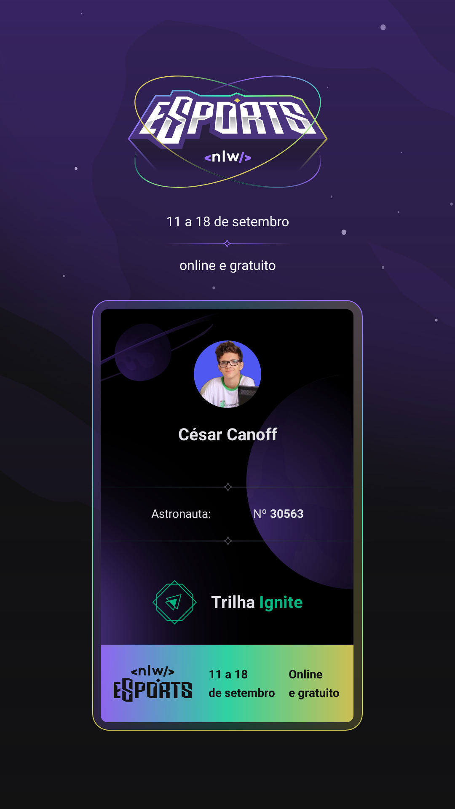

<div align="center">
 
 <h1>🟣 Next Level Week - eSports 🟣</h1>
</div>


### 🏆 Tópics
  - Description
  - Stacks and Tools
  - Quick Start

## ✒️ Description

The project is called *Find your Duo*.
It is a platform to find the partner to play together.

<p align="center">
</p>

## 📚 Stack and Tools
* [Node.js](https://nodejs.org/)
* [Prisma](https://www.prisma.io/)
* [React](https://reactjs.org/)
* [React Native](https://reactnative.dev/)
* [Expo](https://expo.dev/)
* [Figma](https://www.figma.com/)
* [Radix UI](https://www.radix-ui.com/)

## ⏩ Quickstart

### 🟣 Running Server

First, create a new ``.env`` file on the root directory, using the `.env.example` template as base.

Then, to create the local db run:
```sh
$ npm install
$ npm run db:migrate
```

After that, to start the server, run:
```sh
$ npm run dev
```

### 🟣 Web

To run the local Vite web client:
```sh
$ npm install
$ npm run dev
```

<details><summary>🟣 My Event Ticket</summary><br />
 
</details>
